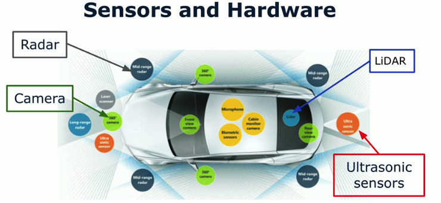
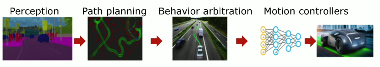
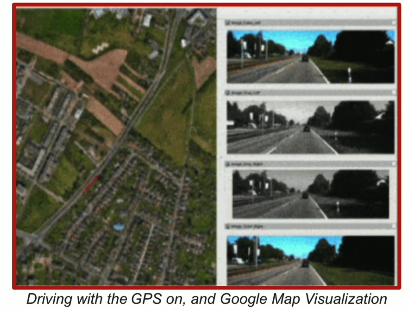
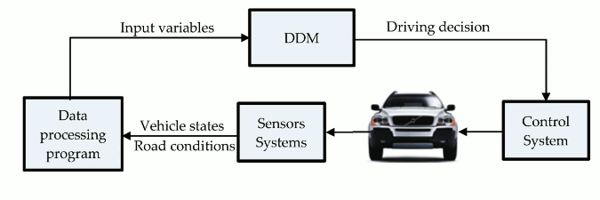

# Overview of Self-Driving Car
<quote>
​Self-driving cars represent ​a significant leap in automotive technology. ​They are driven by advancements ​in artificial intelligence, ​sensor technology, and complex algorithms. ​These vehicles are designed to ​navigate and operate without human intervention. 
They increase accessibility for those unable to drive, ​promote fuel efficiency, and minimize parking needs.
Self-driving cars rely on ​sophisticated systems that help ​them perceive their environment, ​make decisions, and drive autonomously. 
</quote>

## 1. Key Technologies

<h3>Sensors &amp; Hardware</h3>

<ul>
  <li>Detect and interpret the vehicle's surroundings.</li>
  <li>Collect real-time environmental data:
    <ul>
      <li>Road conditions</li>
      <li>Obstacles</li>
      <li>Movement of other vehicles</li>
    </ul>
  </li>
</ul>

<h3>AI &amp; ML</h3>
<ul>
  <li>Process data gathered by sensors</li>
  <li>ML alg (DL models): Recognize Objects, Understand scenes, Predict behavior of other drivers</li>
  <li>Make informed decision: Accelerating, Braking, Steering, and Navigating complex traffic scenarios</li>
</ul>

<h3>Mapping &amp; Localization</h3>
<ul>
  <li>High-definition maps: Load layouts, Traffic signals, Other critical infrastructure</li>
  <li>Maps with GPS & IMUs (Inertial Measurement Units) help the vehicle determine its precise location and navigate accurately.</li>
</ul>

<h3>Real-time Processing &amp; Decision Making</h3>
<ul>
  <li>Onboard computer:
    <ul> 
    <li>Process sensor data & make immediate desicions</li>
    <li>Ensure appropriate react time to dynamic environment changes</li>
    </ul> 
    </li>
</ul>

