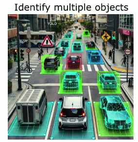
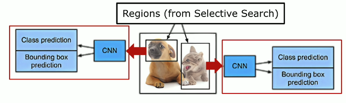
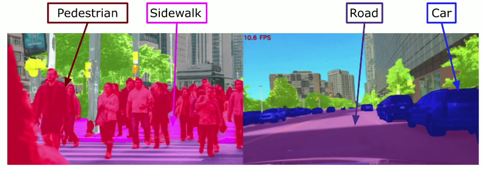
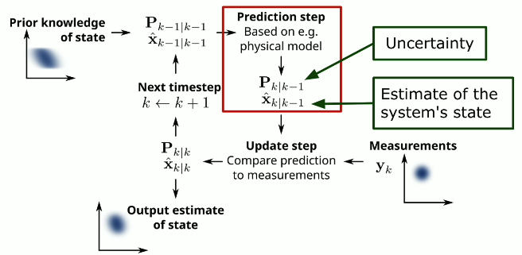
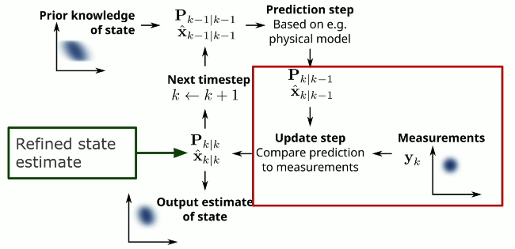
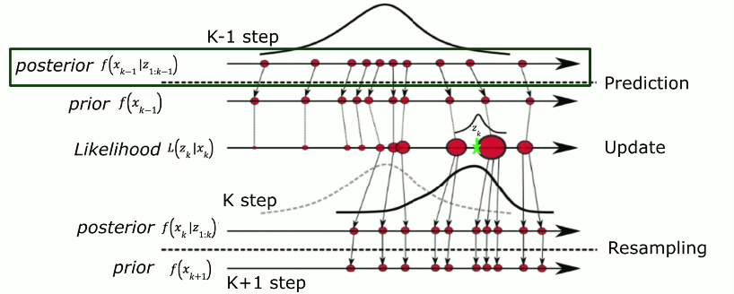
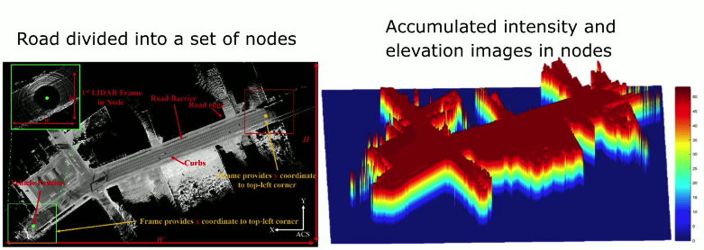
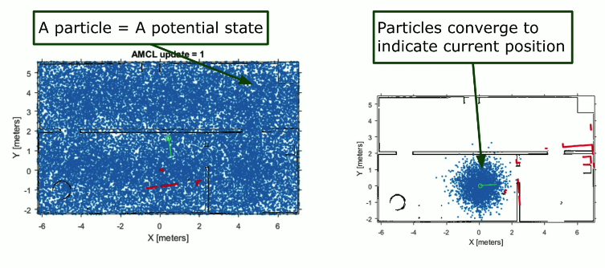
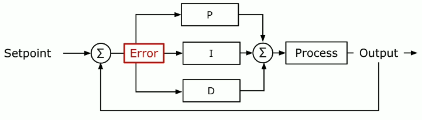

# Algorithms in Self-Driving Cars

​Self-driving cars represent ​a revolutionary advancement in transportation, ​which are made possible by ​a complex combination of algorithms. ​These algorithms allow autonomous vehicles ​to **perceive their surroundings, ​make decisions, and ​safely navigate different environments**. 

​Here, we will dive into the key algorithms ​that underpin the functionality of self-driving cars. 

​Based on functions, they can ​be categorized into:

- Perception
- Localization
- Path Planning
- Control
- Decision-making
- Communication. ​

## 1. Perception

Perception is a foundation of self-driving technology. ​To navigate effectively, ​a self-driving car must first understand its environment. ​This is achieved through:

- Object Detection
- Semantic Segmentation
- Sensor Fusion

### 1.1. Object Detection

- ​Convolutional neural networks are ​extensively used to detect and classify objects, ​such as pedestrians, vehicles, and traffic signs. 
    - ​Algorithms such as YOLO and ​the region-based CNN provide real-time object detection. 
    - ​This capability is crucial for ​responding to dynamic road conditions. 

- **​YOLO** identifies and classifies multiple objects in ​an image or video frame by ​processing the entire image in a single evaluation. 

- **​Region-based CNN** identifies regions of interest ​in an image and applies CNNs to classify them. 

### 1.2. Semantic Segmentation

- ​Algorithms such as **DeepLab** and **​U-Net** classify each pixel in an image (Pixel-level classification). ​This allows the car to distinguish ​between various elements such as roads, ​sidewalks, and obstacles. 

- ​The example shows a segmented street image ​where different classes such as pedestrians, ​sidewalk, road and cars are labeled in different colors. ​Having this pixel level understanding helps ​the car navigate through complex environments. ​

### 1.3. Sensor Fusion

The **Kalman filter and the particle filter** ​are used to combine data from multiple sensors, ​such as Lidar, radar, and cameras. ​This creates a comprehensive and accurate model ​of the car's surroundings. ​
These algorithms help filter out noise and uncertainties, ​giving reliable data for decision making.

**Kalman filter**

- ​The Kalman filter keeps track of the estimated state of ​the system and the variance ​or uncertainty of the estimate. 
- ​The prediction step uses the state estimate from ​the previous timestep to produce ​an estimate of the state at the current timestep. 

<figcaption><em>Prediction Step</em></figcaption>

- ​In the update step, ​the difference between the prediction ​and measurement is multiplied by ​an optimal common gain and combined with ​the previous state estimate to refine the state estimate. 

<figcaption><em>Update Step</em></figcaption>

**Particle filter** framework diagram

- ​The posterior distribution is approximated by a set of ​weighted particles which represent ​the state of the system. 
- ​When a new merriment data is available for prediction, ​the weights of the particles are updated ​according to likelihood function ​to account for the new data point. 
- ​The weights are resampled to ​enhance the diversity among particles. ​This in turn refines ​the posterior distribution at the current timestep. ​

## 2. Localization and Mapping Algorithm

Once a car understands its environment, ​it needs to know its precise location within that space. ​This is where localization and ​mapping algorithms come into play. ​The common localization and mapping algorithms ​include: 

- SLAM (Simultaneous Localization and Mapping)
​- Monte Carlo Localization (MCL)
- Visual Odometry. 

### 2.1. SLAM

- **​Extended Kalman filter SLAM** and ​**graph-based SLAM** are commonly used ​for real-time mapping and location tracking. 
- ​SLAM algorithms: allow the car to ​build and update a map of its surroundings, ​while simultaneously ​determining its position within that map.
- ​Here is an example of graph SLAM to generate ​precise 2.5D LIDAR maps in an XYZ plane. ​A node strategy divides the road into a set of nodes. ​The latter point clouds are smoothly ​accumulated in ​intensity and elevation images in each node. 

### 2.2. Monte Carlo Localization (MCL)

- ​Monte Carlo localization uses ​a probabilistic approach to estimate ​the car's position by 
    - Maintaining ​multiple hypothesis about its location
    - The car moves and collects new data 
    - Algorithm continuously refines ​its estimates to enhance accuracy

- The example here shows ​the algorithm of Monte Carlo localization. ​You need a particle filter to estimate position. ​In the left graph, blue particles ​represent the car's possible states. ​Each particle corresponds to a potential state. ​As shown in the right graph, ​the particles converge around a single location as ​the car move and ​senses its surrounding with the range sensor. 

### 2.3. Visual Odometry

- Use ​camera images to estimate ​the vehicle's motion
- ​Algorithms, such as **ORB-SLAM** and **Stereo Vision** use ​camera images to estimate ​the vehicle's motion by ​tracking visual features across frames. 
- ​These methods are crucial for accurate localization, ​especially in environments where ​GPS signals may be unreliable. 

## 3. Path Planning

- Path planning algorithms determine ​the safest and most efficient route ​for the car to follow.
- Depending on functions, ​the algorithms include:

    - Global Path Planning
    - Local Path Planning
    - Trajectory Organization

### 3.1. Global Path Planning

​The **A\*** algorithm and ​**Dijkstra's algorithm** are widely used to ​compute the shortest path from ​the car's current position to its destination. 

- **​A\*** uses heuristics to optimize the search
- **Dijkstra's algorithm** guarantees ​the shortest path by exploring all possible routes. 

### 3.2. Local Path Planning

- **​Rapidly-exploring random trees** (RRT) and ​the **dynamic window approach** (DWA) are often ​employed for navigating around obstacles in real-time. 
- ​These algorithms are essential ​for handling dynamic environments, ​ensuring the car can avoid ​collisions while following the global path. 

### 3.3. Trajectory Organization

- ​Model predict control is ​an advanced technique that continuously ​optimizes the car's trajectory by predicting ​future states and adjusting the path accordingly. 
- ​This method ensures smooth, safe, ​and efficient driving, especially in complex scenarios. 

# 4. ​Control Algorithms

- Responsible for executing ​the planned path by managing ​the car's steering, acceleration, and braking. 
- ​These algorithms ​include
    - Proportional-Integral-Derivative Control (PID Control)
    - Linear Quadratic Regulator (LQR)
    - Adaptive Cruise Control (ACC)

### 4.1. Proportional-Integral-Derivative Control (PID Control)

​As a classic control algorithm, ​PID control adjusts the cast controls to ​minimize error between ​the desired trajectory and extra path. ​It is widely used for tasks such ​as lane keeping and speed regulation. 

### 4.2. ​Linear quadratic regulator 

- Optimize ​vehicle dynamics by minimizing a cost function. 
- Balances between ​trajectory accuracy and control effort.
- ​This results in smoother and more stable driving. 

### 4.3. Adaptive Cruise Control Algorithm (ACC)

- Adjust ​the car's speed to keep ​a safe falling distance from the vehicle in front. 
- ​They use a radar and ​camera to monitor the road condition. 

## 5. Decision Making
​
Decision making algorithms determine ​how the car reacts to various driving scenarios. 

### 5.1. Behavior Planning

- **​Finite State Machines (FSM)** and **Markov Decision Processes (MDP)** are ​often used to manage ​driving behavior planning such as lane changes, ​overtaking, and stopping. 
- These algorithms allow the car to switch between ​different driving modes based on the current situation. 

### 5.2. Reinforcement Learning

- ​Deep Q-networks are a type of ​reinforcement learning that allows the car to learn ​optimal driving strategies through trial and ​error by receiving rewards for successful actions. 
- ​This approach is particularly effective in ​complex dynamic environments where ​predefined rules might not be sufficient. 

## 6. Communication Algorithms

- Communication algorithms enable ​self-driving cars to interact ​with their environment and other vehicles. 

- V2X (​Vehicle-to-everything) algorithm
    - Facilitate communication ​between the car and other vehicles, ​infrastructure, and pedestrians. 
    -This allows for coordinated movements, ​reducing the risk of accidents, ​and improving traffic flow. 
​
